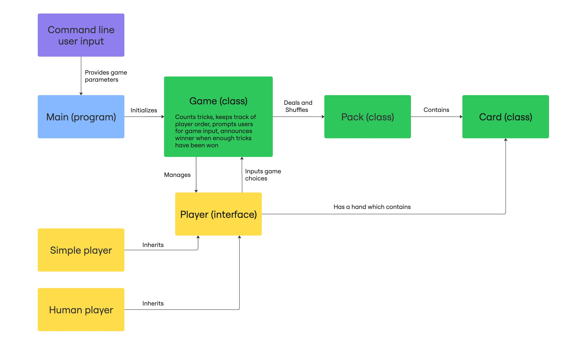
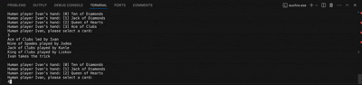

# EECS 280 Euchre Project

This project is a C++ implementation of the card game Euchre.

❓ What it does: Allows two teams of players (human or computer) to play a full game of Euchre.

👩‍💻 Who it’s for: Students learning C++ fundamentals such as object-oriented design, polymorphism, operator overloading, and unit testing.

🤷‍♀️ Why it exists: Developed as a  project for Michigan EECS 280 (Programming and Intro Data Structures), this project integrates multiple course concepts into one larger system.


## Table of Contents
- Quickstart Guide
- Features
- tecture Overview
- Usage Examples
- FAQ
- Dependencies
- Contributing
- Acknowledgements
## Quickstart Guide

#### Prerequisites
- C++ compiler supporting C++11 or later (e.g., g++, clang++)
- Make for build automation

#### Installation
- Clone the repository:

```bash
git clone https://github.com/amartin217/p3-euchre.git
cd p3-euchre
```

- Build the project:

```bash
make euchre.exe
```

- Run the game:

```bash
./euchre (parameters here)
```

Example Run: 


## Usage Examples

To play euchre, you must provide an input pack file, select "shuffle" or "noshuffle", and input the names and types of players. Here are some examples of usage with different parameters.

#### All AI (Simple) Players:

```bash
./euchre.exe pack.in noshuffle 3 Bob Simple Alice Simple Jeffrey Simple Miranda Simple 
```

#### All Human Players:

```bash
./euchre.exe pack.in shuffle 3 Bob Human Alice Human Jeffrey Human Miranda Human
```

#### Both AI (Simple) and Human Players:

```bash
./euchre.exe pack.in shuffle 3 Bob Simple Alice Human Jeffrey Human Miranda Simple 
```


## Features

#### Card & Deck System:
- Full 24-card Euchre deck (pack class)
- Shuffling, dealing, and operator-overloaded comparison

#### Player Types:
- Human player (command-line interaction)
- AI "Simple" player (follows basic heuristic rules)

#### Gameplay Mechanics:
- Trump selection & ordering up
- Trick-taking logic
- Team scoring

#### Testing:
- Unit tests for Card, Deck, and Player classes


## Architecture Overview

Euchre Project Architecture Diagram:



## FAQ

Q: Do I need to know the rules of Euchre to use this project?  
A: Not necessarily since the game enforces rules automatically. However, some familiarity helps!


Q: Can I write my own AI player?  
A: Yes, just inherit from the Player abstract class and implement the required methods.


Q: Does it work outside of EECS 280?  
A: Absolutely. It’s standard C++11 and portable across Linux, macOS, and Windows.


Q: When selecting a card, should the brackets be included? i.e should I type "[0]" or "0"?  
A: The brackets are not included! Here is an example:



## Dependencies

- Standard C++ library
- Make build system

## Contributing

Contributions are welcome!
- Fork the repository
- Create a feature branch (git checkout -b feature/custom-ai)
- Commit your changes (git commit -m "Added custom AI player")
- Push to the branch (git push origin feature/custom-ai)
- Open a Pull Request

## Acknowledgements

- University of Michigan, EECS 280 Staff
- Euchre enthusiasts who inspired the project
