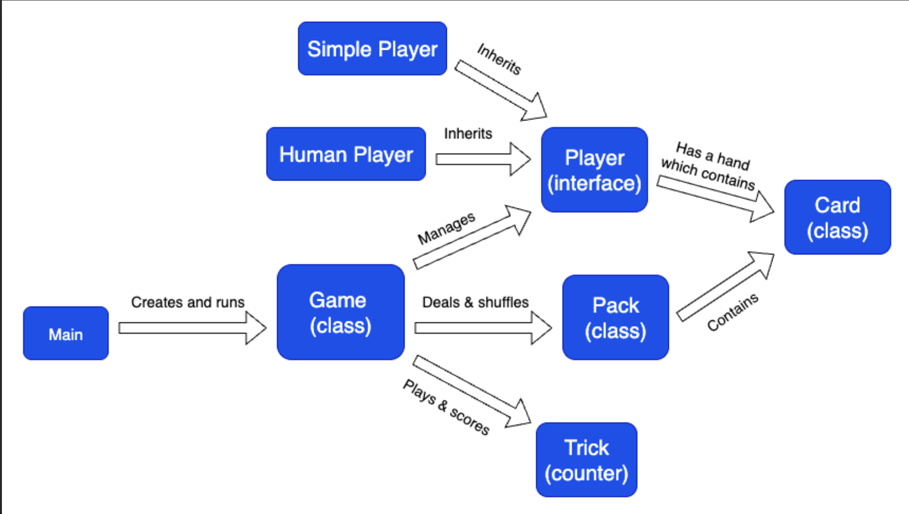

# EECS 280 Euchre Project

This project is a C++ implementation of the card game Euchre.

❓ What it does: Allows two teams of players (human or computer) to play a full game of Euchre.

👩‍💻 Who it’s for: Students learning C++ fundamentals such as object-oriented design, polymorphism, operator overloading, and unit testing.

🤷‍♀️ Why it exists: Developed as a  project for Michigan EECS 280 (Programming and Intro Data Structures), this project integrates multiple course concepts into one larger system.


## Table of Contents
- Quickstart Guide
- Features
- Architecture Overview
- Usage Examples
- FAQ
- Dependencies
- Contributing
- Acknowledgements
## Quickstart Guide

#### Prerequisites
- C++ compiler supporting C++11 or later (e.g., g++, clang++)
- make for build automation

#### Installation
- Clone the repository:

```bash
git clone https://github.com/amartin217/p3-euchre.git
cd p3-euchre
```

- Build the project:

```bash
make euchre.exe
```

- Run the game:

```bash
./euchre (parameters here)
```

Example Run:


## Features

#### Card & Deck System:
- Full 24-card Euchre deck (pack class)
- Shuffling, dealing, and operator-overloaded comparison

#### Player Types:
- Human player (command-line interaction)
- AI "Simple" player (follows basic heuristic rules)

#### Gameplay Mechanics:
- Trump selection & ordering up
- Trick-taking logic
- Team scoring

#### Testing:
- Unit tests for Card, Deck, and Player classes


## Architecture Overview

Euchre Project Architecture Diagram:



## FAQ

Q: Do I need to know the rules of Euchre to use this project?
A: Not necessarily since the game enforces rules automatically. However, some familiarity helps!

Q: Can I write my own AI player?
A: Yes, just inherit from the Player abstract class and implement the required methods.

Q: Does it work outside of EECS 280?
A: Absolutely. It’s standard C++11 and portable across Linux, macOS, and Windows.

## Dependencies

- Standard C++ library
- make build system

## Contributing

Contributions are welcome!
- Fork the repository
- Create a feature branch (git checkout -b feature/custom-ai)
- Commit your changes (git commit -m "Added custom AI player")
- Push to the branch (git push origin feature/custom-ai)
- Open a Pull Request

## Acknowledgements

- University of Michigan, EECS 280 Staff
- Euchre enthusiasts who inspired the project
- shields.io for README badges
